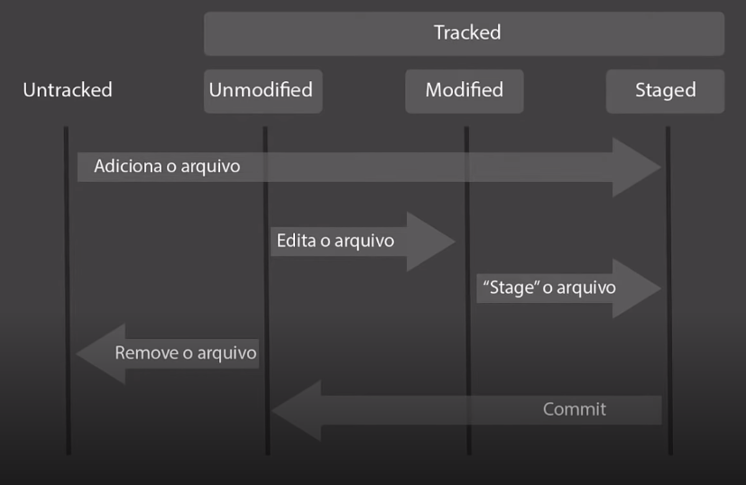

<h1 align="center"> dio-orange-tech-00-intro-git-e-github </h1>
<h2 align="center">Repositório do 1º projeto do BootCamp Orange Tech sobre Git e GitHub</h2>

# Sumário

- [O que é Git e GitHub ?](#o-que-é-git-e-github)
  - [Git](#git)
  - [GitHub](#github)
- [Comandos básicos no terminal](#comandos-básicos-no-terminal)
  - [Windows](#windows)
  - [Linux](#linux)
- [Git "por baixo dos panos"](#git-"por-baixo-dos-panos")
  - [SHA](#sha)
  - [Objetos internos do Git](#objetos-internos-do-git)
  - [Chave SSH e Token](#chave-ssh-e-token)
- [Primeiros comandos com o Git](#primeiros-comandos-com-o-git)
- [Ciclo de vida dos arquivos no Git](#ciclo-de-vida-dos-arquivos-no-git)
- [Resolvendo conflitos](#resolvendo-conflitos)

# O que é Git e GitHub ?
  Pela frequência do uso dos dois termos de maneira conjunta, é comum que cause certa confusão em pessoas que estão tendo seu primeiro contanto com eles, levando a acreditar que ambos termos tratam-se da mesma coisa. Mas, não são! Vou explicar o porquê nos tópicos abaixo. 👇

## Git
  Criado em 2005, por Linus Torvalds e sua equipe, trata-se de um **sistema de versionamento distribuído**, o qual permite que cada linha de código modificada ou nova, seja versionada e salva corretamente, desta maneira podemos transitar facilmente pelas versões mais antigas do nosso código ou realizar novas implementações de maneira segura.

## GitHub
  Desenvolvido pela Microsoft, o github é uma plataforma que permite a hospedagem do nosso código em um ambiente de maneira remota, trazendo benefícios como:
  - Armazenamento em nuvem
  - Facilitação do trabalho em equipe
  - Melhorio do seu código (por meio de feedback de outras pessoas desenvolvedoras a respeito dele).

# Comandos básicos no terminal
  Comandos básicos para trabalhar com o terminal, Linux & Windows:

## Windows:
  - `dir` >> Traz uma lista de diretórios contidos na pasta em que estamos situados.
  - `cd` >> Caminha até determinado arquivo | cd ~> "change directory".
    - `cd ./` >> caminha para um diretório interno.
    - `cd ../` >> Volta um diretório.
  - `cls` >> Limpa o terminal | cls -> "clear screen".
  - `mkdir` >> Cria uma pasta nova | mkdir -> "make directory".
  - `echo hello > hello.txt` >> Insere o conteúdo hello dentro de um novo arquivo "hello.txt".
  - `del diretorio_exemplo` >> Deleta todos arquivo dentro de um diretório.
  - `rmdir diretorio_exemplo /S /Q` >> Deleta um diretório juntamente com todos seus arquivos.
    - "/S" >> Deleta a árvore de arquivos do diretório.
    - "/Q" >> Não pede por confirmação ao deletar a árvore de um diretório.

## Linux:
  - `ls` >> Traz uma lista de diretórios contidos na pasta em que estamos situados.
  - `cd` >> Caminha até determinado arquivo | cd ~> change directory
    - `cd ./` >> Caminha para um diretório interno
    - `cd ../` >> Volta um diretório
  - `clear` >> Limpa o terminal.
  - `mkdir` >> Cria uma pasta nova | mkdir -> "make directory". 
  - `echo hello > hello.txt` >> Insere o conteúdo hello dentro de um novo arquivo "hello.txt".
  - `rm -rf diretorio_exemplo` >> Deleta um diretório juntamente com todos seus arquivos de maneira recursiva e forçada.

# Git "por baixo dos panos"

## SHA
  - `Secure Hash Algorithm`, trata-se de um conjunto de funções has **criptográficas** projetas pela National Secure Agence dos Estados Unidos. Ele permite que o Git identifique os arquivos de uma maneira única e suas eventuais mudanças.
    - Gera um conjunto de caractéres identificador de 40 dígito. >> É uma forma curta de representar um arquivo.
    - `openssl sha1 arquivo.txt` >> Esse comando gera o hash para determinado arquivo.
## Objetos internos do Git
  - `Blobs`
    - Bloco básico de composição, Os arquivos ficam guardados dentro de objetos chamados "Blobs", que contêm metadados sobre os arquivos, registrando o seu tipo(blob), seu tamanho, "\0", e seu conteúdo.
  - `Trees`
    - Armazenam blobs e outras árvores, contêm metadados, guardando o nome dos arquivos presentes em cada blobs que a constitui, "\0", e seu tamanho
  - `Commits`
    - Um objeto que aponta para uma árvore, para o último commit realizado antes dele, para o autor, para uma mensagem, e para o seu "timestamp", englobando tudo. Todos objetos possui um sha1 e cada mundança e refletida no sha1 de cada objeto, identificando e deixando muito claro qualquer modificação.

## Chave SSH e Token
  Para enviar códigos para o GitHub, alguns processos de segurança são necessários.

  - Chave SSH: Uma maneira segura e encriptada de estabelecer conexão entre duas máquinas.

  - Token de acesso pessoal: A cada vez que realizarmos um commit ou ao clonar um repositório, o GitHub precisará do Token de acesso pessoal para realizar a operação.

# Primeiros comandos com o Git
  - `git config` >> Seta as configurações de usuário para uso do git no repositório corrente
    - `git config --global` >> Flag --global para adicionar as configurações globalmente
  - `git init` >> Inicia um repositório Git no diretório em questão. | Repo .git
  - `git add arquivo.txt` >> Adiciona um arquivo e suas mudanças ao repositório Git.
  - `git commit` >> Adiciona uma mensage para descrever as últimas mudanças realizadas no arquivo em questão.
  - `git push` >> "Empurra" as últimas mudanças do repositório local para o repositório remoto.
  - `git pull` >> "Puxa" as mudanças do repositório remoto para o local.
# Ciclo de vida dos arquivos no Git
Ao iniciar um repositório Git cada arquivo tem um status, e um "ciclo de vida".
  - `Untracked` >> 1º agrupamento ~> São arquivos quais o Git ainda não tem ciência e registros
  - `Tracked` >> 2º agrupamento ~> É constituido por arquivos que já foram adicionados ao diretório .git;
    - `Unmodified` >> 1º estágio ~> Arquivos que estão na mesma versão do último commit, resumindo, não foram modificados.
    - `Modified` >> 2º estágio ~> Arquivos que sofreram alterações e portanto têm um hash diferente ao seu anterior.
    - `Staged` >> 3º estágio ~> Arquivos que tiveram suas últimas mudanças adicionadas ao diretório .git.

    ;

# Resolvendo conflitos
Quando um código, sofre uma alteração na mesma linha, por mais de uma máquina diferente, resulta em um **conflito de versão** no GitHub, caso o código tenha sido "empurrado"(com git push), ou na sua máquina ao ser "puxado"(com git pull) do repositório remoto.
Em um conflito, o GitHub não vai decidir nada automáticamente, ele vai esperar que o usuário abra o arquivo com o conflito e resolva-o manualmente e então empurre o código com a versão correta mais atualizada.
